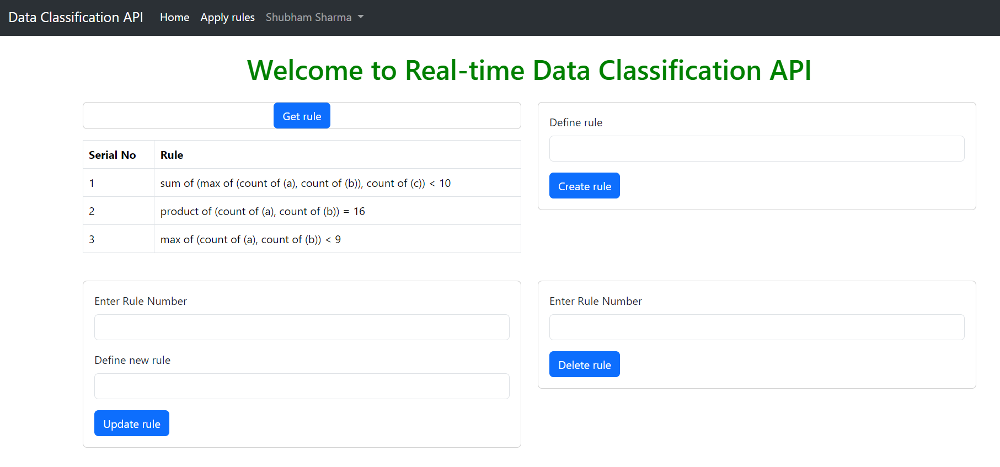
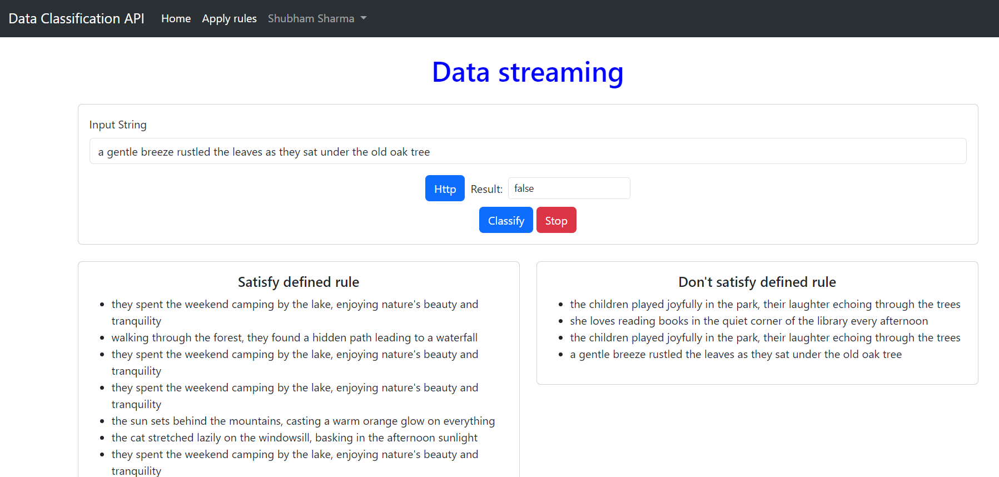

# Express API

API that processes a live stream of data, classifies it based on user-defined classification rules, and authenticates incoming requests using JWT tokens.

## CRUD operations for rules

## Classification of queries
- Http request
- web socket connection

## Load test result

- 450 req/sec

